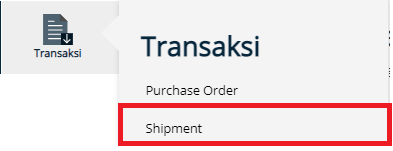
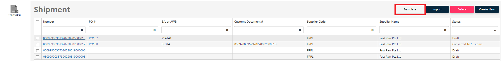
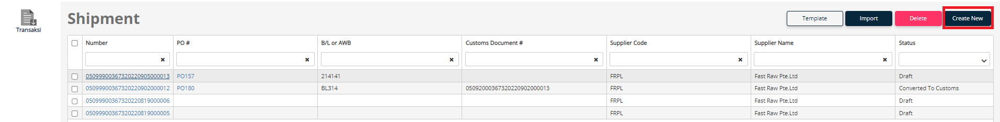

# Shipment
If the user wants to send goods to fulfill the **Purchase Order** received, then the user can create a document in the **Shipment** menu.

There are 3 ways to make a shipment document, as follows:

## From Purchase Order Document
Users can create a shipment document from a purchase order document.
- Go to [Purchase Order Guide](/klriuip/dokumenpurchaseorder/)

## From Import Template
To make a Shipment document, the user can use the template that has been provided.

1. Click **Transaction** Menu
2. Choose **Shipment**

3. Click **Template** button
4. Complete the data for the sheet **Shipment, Detail, and Document**
5. The id on the Shipment sheet is used to link with Details and Documents
6. To fill in **Port** use the Port Code (ex: **IDTPP** for Tanjung Priok)
7. To fill in **Date** use the format: **dd/mm/yyyy** or **yyyy-mm-dd**
8. After all the **TemplateShipment.xlsx** data has been completed, it can be imported using the **Import** button.
9.  After the import is complete, the data in the template will be formed into a shipment document, and the status is **Draft**
10. To view the document data, the user can click the desired number
11. If all data has been completed, the user can press the **Submit** button
12. When it is finished, the Shipment document will be in the status of **Ready**
13. After the user internal has processed the Shipment document and has made the PIB document, the status of the Shipment document will be **Converted to PIB**

## From Add New Button
To perform manual document creation, users can use the **Add New** button for document creation.

1. Click **Transaction** Menu
2. Choose **Shipment**

3. Click **Create New**
4. After the user press the **Create New** button, the user will be asked to complete the data that must be filled with the symbol *
5. After completing the required data, the user can press the **Save** button
6. After that, 5 new tabs will appear, namely **Purchase Order, Goods, and Vendor Documents, Packing, & Container**
7. On the **Purchase Order** tab user can use the **Get All Outstanding** button, to send all **Purchase Orders** with **New** status, or use the **Choose Purchase Order** button, with the **Choose Purchase Order** button the user can choose whether to ship based on **Purchase Oder** document or by per unit.
8. After all data is completed, the user can press **Submit** button to complete the document **Shipment**
9.  When it is finished, the Shipment document will be in the status of **Ready**
10. After the buyer company has processed the Shipment document and has made the PIB document, the status of the Shipment document will be **Converted to PIB**

