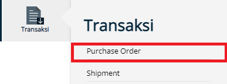
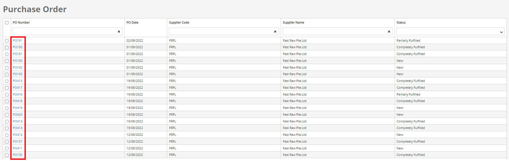
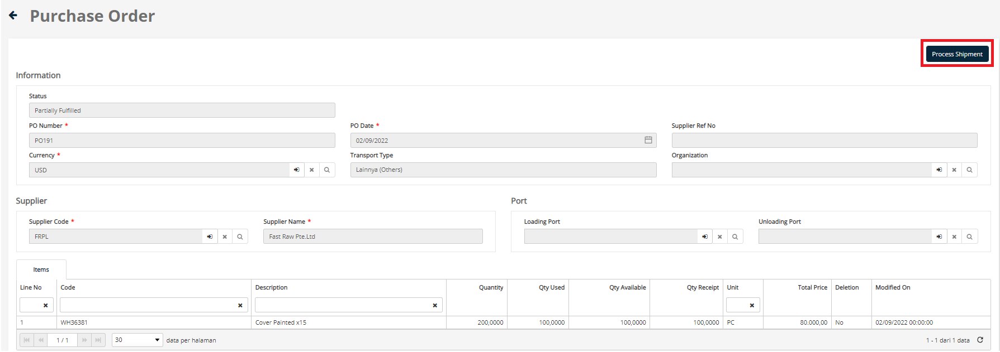

# Purchase Order
If the buyer company has made a **Purchase Order** document, then the user will see the **Purchase Order** Number that has been created by the buyer, Purchase Order has 3 statuses, namely:
- **New**, after the buyer company has made a Purchase Order document, the purchase order document will be sent to the supplier by vendor username
- **Partially Fulfilled**, after the supplier completes several orders, the purchase order document will be partially fulfilled
- **Completely Fulfilled**, after the supplier completes all the orders, the purchase order document will be completely fulfilled

A supplier can make a shipment document from a purchase order document that has been made by the buyer company:

1. Click **Transaction** Menu
2. Choose **Purchase Order**

3. User can click the **Purchase Order** number to view the **Purchase Order** document data

4. If the user wants to fulfill the **Purchase Order**, then the user can use the **Process Shipment** button
5. Choose **Shipment Type**
6. Press the **Confirm** button
7. Automatically will create a Shipment document, and then the user can complete the data, the data that must be filled has the symbol *
8. After the user completes the Shipment document, and already fulfilled all the orders, then the status of **Purchase Order** Number will be **Completely Fulfilled**